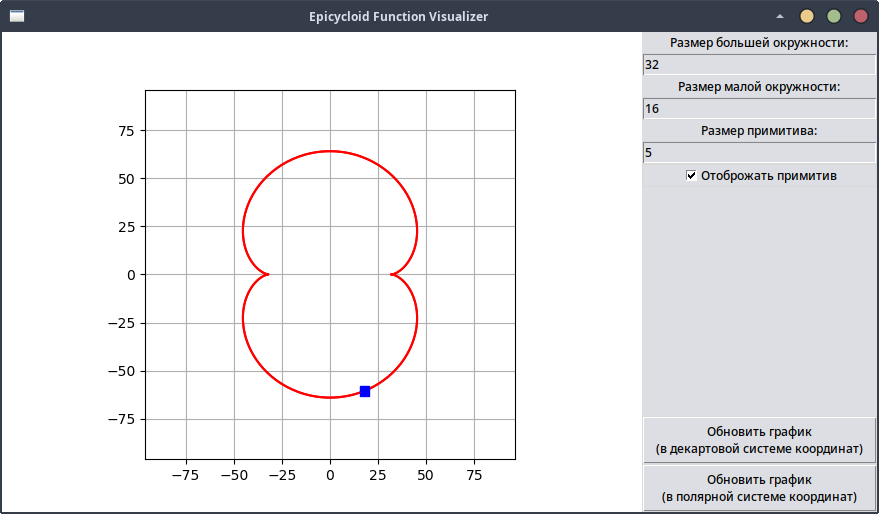

Description in English. My english may be bad and here [описание на русском](README_RU.md).  
# Epicycloid (Cardioid, Nephroid, etc) Function Visualizer.
  
Written in Python.  
License GPLv3.  
Author Atom42.  
A simple project to visualize an epicycloid. There is also animation of the primitive moving along the curve graph.  
## Dependencies
- tkinter  
- matplotlib  
- numpy  

These Python packages must be installed for the program to work.  

## What does each file do?
1. epicycloid_gui.py - contains a Cartesian and polar coordinate system, has a GUI.  
2. epicycloid_cartesian_cli.py - contains only the Cartesian coordinate system, parameters are set via cli.  
3. epicycloid_polar_cli.py - contains only the Polar coordinate system, parameters are set via cli.  

## What in plans?
1. Make the program normal  
